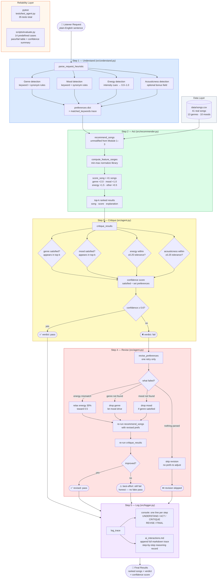

# Music Recommender Agent — System Architecture

```mermaid
flowchart TD
    A([🎵 Listener Request\nplain-English sentence]) --> B

    subgraph UNDERSTAND ["Step 1 — Understand (src/understand.py)"]
        B[parse_request_heuristic]
        B --> B1[Genre detection\nkeyword + synonym rules]
        B --> B2[Mood detection\nkeyword + synonym rules]
        B --> B3[Energy detection\nintensity cues → 0.0–1.0]
        B --> B4[Acousticness detection\noptional bonus field]
        B1 & B2 & B3 & B4 --> B5[preferences dict\n+ matched_keywords trace]
    end

    B5 --> C

    subgraph ACT ["Step 2 — Act (src/recommender.py)"]
        C[recommend_songs\nunmodified from Module 1–3]
        C --> C1[compute_feature_ranges\nmin-max normalize library]
        C1 --> C2[score_song × 41 songs\ngenre +2.0 · mood +1.0\nenergy ×1.5 · other ×0.5]
        C2 --> C3[top-k ranked results\nsong · score · explanation]
    end

    C3 --> D

    subgraph CRITIQUE ["Step 3 — Critique (src/agent.py)"]
        D[critique_results]
        D --> D1{genre satisfied?\nappears in top-k}
        D --> D2{mood satisfied?\nappears in top-k}
        D --> D3{energy within\n±0.25 tolerance?}
        D --> D4a{acousticness within\n±0.25 tolerance?}
        D1 & D2 & D3 & D4a --> D4[confidence score\nsatisfied ÷ set preferences]
        D4 --> D5{confidence ≥ 0.6?}
        D5 -->|yes| PASS([✅ verdict: pass])
        D5 -->|no| FAIL([❌ verdict: fail])
    end

    PASS --> LOG
    FAIL --> E

    subgraph REVISE ["Step 4 — Revise (src/agent.py)"]
        E[revise_preferences\none retry only]
        E --> E1{what failed?}
        E1 -->|energy mismatch| E2[relax energy 30%\ntoward 0.5]
        E1 -->|genre not found| E3[drop genre\nlet mood drive]
        E1 -->|mood not found| E4[drop mood\nif genre satisfied]
        E1 -->|nothing parsed| E5[skip revision\nno prefs to adjust]
        E2 & E3 & E4 --> E6[re-run recommend_songs\nwith revised prefs]
        E6 --> E7[re-run critique_results]
        E7 --> E8{improved?}
        E8 -->|yes| E9([✅ revised: pass])
        E8 -->|no| E10([⚠️ best-effort: still fail\nhonest — no fake pass])
        E5 --> E11([⏭️ revision skipped])
    end

    E9 & E10 & E11 --> LOG

    subgraph LOG ["Step 5 — Log (src/logger.py)"]
        LOG1[log_trace]
        LOG1 --> LOG2[console: one line per step\nUNDERSTAND / ACT / CRITIQUE\nREVISE / FINAL]
        LOG1 --> LOG3[ai_interactions.md\nappend full markdown trace\nstep-by-step reasoning record]
    end

    LOG --> OUT([🎵 Final Results\nranked songs + verdict\n+ confidence score])

    subgraph DATA ["Data Layer"]
        CSV[(data/songs.csv\n41 real songs\n13 genres · 10 moods)]
        CSV --> C
    end

    subgraph TEST ["Reliability Layer"]
        T1[pytest\ntests/test_agent.py\n35 tests total]
        T2[scripts/evaluate.py\n14 predefined cases\npass/fail table + confidence summary]
    end

    style UNDERSTAND fill:#dbeafe,stroke:#3b82f6
    style ACT fill:#dcfce7,stroke:#16a34a
    style CRITIQUE fill:#fef9c3,stroke:#ca8a04
    style REVISE fill:#fee2e2,stroke:#dc2626
    style LOG fill:#f3e8ff,stroke:#9333ea
    style DATA fill:#f1f5f9,stroke:#64748b
    style TEST fill:#fff7ed,stroke:#ea580c
```